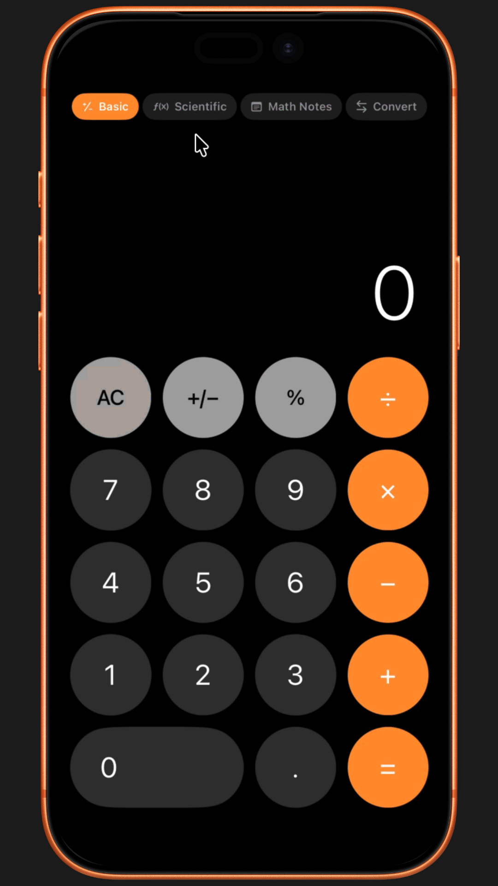

# Open SwiftUI Apps

## Fully functional and working SwiftUI apps you can modify, extend, and publish to the iOS App Store. 

Each iPhone app is well-crafted with Bitrig and state-of-the-art (SOTA) agentic coding models such as Claude Opus 4.6 and Codex 5.3. You're welcome to contribute by creating a new issue or pull request. 

| App Name | Initial Prompt | SwiftUI App | App Demo |
|----------|----------------|-------------|----------|
|    Shimmer Lab      |       Create a shimmering animation playground based on the attached image. Users should be able to configure the shimmer animation settings, including progress, color, tint color, duration, size, and invert. The shimmering text can be “Cooking…”. Add buttons to preview the animation.          |     [ShimmerPlaygroundApp.swift](https://github.com/amosgyamfi/open-swiftui-apps/blob/master/OpenSwiftUIApps/ShimmerPlaygroundApp.swift)        |          |
|    Opus 4.6 Four-mode iOS Calculator      |       Modify the source code to build a beautiful, fully functional, iOS/SwiftUI calculator app to perform four main functions/modes. Basic: For basic calculations like addition, subtraction, division, and multiplication. Scientific: For advanced scientific calculations. Math Notes: To solve mathematical expressions, create and use variables, or graph equations—for example, when learning new concepts in class, doing day-to-day budgeting, planning an event, remodeling your home, and more. Convert: To convert one currency into another. Support all major currencies.           |     [Download](https://github.com/amosgyamfi/open-swiftui-apps/tree/master/OpenSwiftUIApps)        |          |

